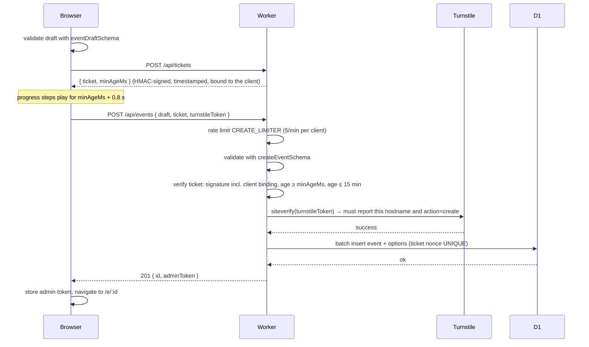

# Architecture

Pikadai is an anonymous date-poll service. Someone creates a poll, shares one link, and people answer and
comment under a name they pick. There are no accounts, no email, no cookies, and polls delete themselves after they expire.

This document explains how the system is put together and why. For the pieces it refers to, see:

- [Cloudflare services](cloudflare.md) for the platform features in use
- [Database](database.md) for the schema and data lifecycle
- [Project structure](project-structure.md) for where the code lives
- [Deployment](deployment.md) for getting it live

## Goals and constraints

| Goal                             | How it shapes the design                                                                                                                                                                                    |
| -------------------------------- | ----------------------------------------------------------------------------------------------------------------------------------------------------------------------------------------------------------- |
| Zero hosting cost                | Everything runs on Cloudflare's free plan: Workers, static assets, D1, Turnstile, cron.                                                                                                                     |
| Anonymous by design              | No personal data is stored. The IP address is used only as a transient rate-limit key and ticket binding, and per-request platform logs are switched off; see [Observability](cloudflare.md#observability). |
| Abuse-resistant without identity | Layered controls: Turnstile, rate limits, server-enforced creation delay, hard size limits.                                                                                                                 |
| Backend stays unexposed          | The API lives on the same origin as the page, has no listing endpoints, and uses unguessable capability URLs.                                                                                               |
| Simple operations                | One Worker, one deploy command, no servers to patch.                                                                                                                                                        |

## High-level design

```
 Browser ──── HTTPS ────▶ Cloudflare edge (one hostname)
                           │
                           ├── Static Assets ─── React SPA + _headers      ◀ every path except /api/*
                           │
                           └── Worker (Hono) ─── /api/*
                                 ├── D1 (SQLite)                 polls, dates, answers, comments
                                 ├── Rate-limit bindings         in-memory, per IP
                                 ├── Turnstile siteverify        outbound HTTPS to Cloudflare
                                 └── Cron trigger                nightly purge of expired polls
```

The SPA and the API share one hostname. That removes CORS entirely and means there is no separately
discoverable API host. Requests for `/api/*` always reach the Worker because of `run_worker_first` in
`wrangler.jsonc`; everything else is served from the asset store, with unknown paths falling back to
`index.html` so the client-side router can handle them.

## Components

**Frontend** (`src/`). React 19 with `react-router`. A root `useReducer` store (`src/state/app.ts`) holds the
poll being viewed, the viewer's tokens and the load status; `AppStateProvider` wraps the router and the page's
sections read it through context hooks (`usePoll`, `usePollActions`) rather than props. The event page fetches a
single `EventView` JSON document and re-fetches it after every mutation; there is no client-side cache or
websocket. Fetches are numbered so a late response never overwrites a newer one; every action names the poll
it is about, so a request that finishes after the user has moved to another poll stores its tokens under the
right one; and a failed re-fetch keeps the loaded poll on screen with a retry instead of replacing it.
Reducers are pure and unit-tested; fetching and `localStorage` writes sit in `pollActions.ts` with injected
dependencies. Forms are validated with the same zod schemas the Worker uses, so users get instant
feedback and the server still has the final say. Tokens are kept in `localStorage`; see
[Trust model](#trust-model-and-identity).

**Worker** (`worker/`). A Hono application. Each route file owns one resource. Cross-cutting concerns live
in `worker/lib/`: token hashing and constant-time comparison, creation tickets, Turnstile verification,
rate limiting, and a typed `HttpError` that the global error handler turns into `{ error, code, details }`
JSON. Database access is isolated in `worker/db/queries.ts` so route handlers never contain SQL.

**Shared** (`shared/`). Zod schemas, the `LIMITS` constant, and the response types. Imported by both sides
through the `@shared/*` path alias. Changing a limit here changes the form, the API, and the error messages
at once.

**Database**. Cloudflare D1, which is SQLite. Five tables. Described in [database.md](database.md).

## Trust model and identity

There are no users, only three kinds of capability tokens. None is stored in plaintext; the database holds
SHA-256 digests, and comparisons use `crypto.subtle.timingSafeEqual`.

| Token       | Bits | Who holds it         | Where it travels                                                                 | What it allows                                 |
| ----------- | ---- | -------------------- | -------------------------------------------------------------------------------- | ---------------------------------------------- |
| Poll id     | 128  | anyone with the link | URL path `/e/:id`                                                                | read the poll, add an answer, suggest a date   |
| Admin token | 256  | the creator          | URL fragment on first visit, then `localStorage`; header `Authorization: Bearer` | edit or delete the poll, any answer, any date  |
| Edit token  | 256  | each participant     | `localStorage`; header `Authorization: Bearer` plus `X-Participant-Id`           | edit or remove their own answer, post comments |

**Why the fragment.** The admin link is `/e/:id#admin=TOKEN`. Browsers never send the fragment to the
server, so the token does not appear in edge logs or referrers. On first load the page copies it into
`localStorage` and rewrites the address bar without it, so a screenshot or a copied URL afterwards does
not leak it. Creation hands the new token to the poll page the same way, so the organiser view opens even
when the browser blocks `localStorage`; the page then warns that the link will not be remembered. There is
no recovery path if the admin link is lost; that is the price of having no accounts, and the UI says so
next to the link.

**Why `Authorization`.** A request carries at most one token, in the standard header: the admin token when
the browser has one, otherwise the participant's edit token, since everything a participant may do the admin
may do too. Cloudflare's log pipeline redacts request headers it recognises as credentials, and that
recognition is heuristic; the standard header is the case it is built for, a custom `X-*` header is a
gamble. The participant id travels separately because it is public anyway.

**Why hashes.** A database leak would expose nothing usable: poll ids are public anyway, and the hashes
cannot be inverted into tokens.

**Who can do what** is decided entirely on the server. The `viewer.isAdmin` flag in `EventView` only
controls what the UI shows; every admin route re-verifies the header.

## Request flows

### Creating a poll



The "artificial delay" is enforced server-side, not just drawn on screen. A ticket is
`<issuedAtMs>.<nonce>.<hmac>`; the Worker signs it with `TICKET_SECRET` together with the requesting
client's rate-limit key (the IPv4 address, or the /64 of an IPv6 address) and will not accept a poll until
the ticket is at least `LIMITS.minCreateDelayMs` old. The ticket response carries that minimum as
`minAgeMs` and the client paces its progress steps on it, so the delay has one source of truth. The nonce
is written to `events.ticket_nonce`, which has a UNIQUE index, so a ticket cannot be replayed, and a ticket
obtained on one network is rejected from another.

Checks run cheapest first: schema, then the local ticket check, then Turnstile, then the database write. A
rejected ticket therefore never costs the user a solved challenge.

### Joining and answering a poll

The name comes before the dates. A name is the one identity a person has in a poll, and both the
availability answers and the comments are posted under it, so it is taken once, in a step of its own. The
page then unfolds in three steps for someone answering (`EventPage` decides which sections render):

| Step              | Condition                                 | On screen                                                                                                   |
| ----------------- | ----------------------------------------- | ----------------------------------------------------------------------------------------------------------- |
| Name              | no identity for this poll in this browser | the title and the Name tile: a name, the Turnstile check, Join                                              |
| Your availability | joined, no date answered yet              | the Name tile (now showing the name, with a rename), the table with only the viewer's own row, the comments |
| Everyone          | at least one date answered                | everyone's rows, the tallies and the best-date highlight, the comments, the share links                     |

Hiding other people's answers until the viewer has given their own keeps the answer honest. The organiser
sees everything from the start, with the Name tile above it offering to join on demand (the Turnstile widget
loads only when they ask), and so does a visitor who can no longer join because the poll is full. "Answered" means at least one date has an answer, including `no`; changing one's
name or commenting does not count, and the top-dates table counts the same people.

1. `GET /api/events/:id` returns the full view: options, participants, votes, comments, and `viewer.isAdmin`.
2. A visitor without an identity for this poll types a name into the Name tile (`NameCard`); the
   Turnstile widget produces a token.
3. `POST /api/events/:id/participants` with an empty vote set checks the participant cap and name
   uniqueness (case-insensitive within the poll), then verifies Turnstile and inserts the row. A unique
   index on `(event_id, name COLLATE NOCASE)` backs the name check, so two simultaneous joins with the
   same name cannot both get in. When the request carries the admin token, the row is marked
   `is_organiser`, and the organiser's name is shown with an outlined "organiser" pill on their answer
   row and on their comments. The client sends the token whenever it has one; the server decides.
4. The response `{ id, editToken }` is stored in `localStorage` under the poll id. The new row opens for
   editing by itself with focus on its first date cell; so does the row of someone who joined earlier
   and has not answered yet.
5. Every save of answers, now and later, sends both as headers to
   `PUT /api/events/:id/participants/:participantId`, which also checks that every vote refers to one of the
   poll's dates. The request carries the name, the votes or both, and a field left out stays as it is: a
   rename from the Name tile sends only the name and one's own answer only the votes, so the two cannot
   overwrite each other when they cross in flight. The organiser renames other people from their rows;
   one's own row shows the name as text.

Until 2026-11-04 the participant endpoints also accept `nickname` in place of `name`, and participants in
the view carry a `nickname` alias, so a tab loaded before the rename keeps working until it is reloaded.

A vote is one of `yes`, `maybe`, `no`. A missing vote means "no answer" and is shown as `·`. Each save
replaces the participant's whole vote set, which keeps the client logic simple and avoids partial updates.
A participant who joined only to comment shows to others as a row of `·`.

### Commenting

Anyone with the link reads the comments; posting one needs the participant token, so the organiser
comments by joining like everyone else. `POST /api/events/:id/comments` carries the edit token and
`X-Participant-Id`, and the Worker refuses anything else with `not_participant`. The text is trimmed and
capped at 512 characters, a poll holds at most 200 comments, and a participant may post one comment every
10 seconds. Both limits are decided by the insert statement itself (`INSERT … SELECT … WHERE NOT EXISTS`
a newer comment by the same participant `AND` the poll's count is under the cap), so simultaneous posts,
by one person or by many, cannot slip through; a refused post is `429 comment_too_soon` or
`409 too_many_comments`, told apart afterwards. The client additionally hides the comment form after one post until the page is
reloaded. Comments show the participant's current name, cannot be edited or deleted, and go when
their participant goes: leaving the poll or being removed by the organiser takes the comments along.

### Suggesting a date

Any reader may `POST /api/events/:id/options` while `allow_suggestions` is on. If the request carries a
valid participant token, the option records `suggested_by` so the UI can tag it. The admin may add dates
regardless of the setting, and only the admin may delete a date. Adding or removing a date recomputes the
poll's expiry.

### Expiry and deletion

`expires_at` is midnight UTC after the last date option plus 30 days, or creation plus 90 days when a poll
has no dates. Reads of an expired poll return `410 Gone` even before the purge runs. A cron trigger fires
daily at 03:17 UTC and deletes expired events; foreign keys cascade to options, participants, votes, and comments.
Admins can delete a poll at any time with the same cascade.

## Abuse controls

The controls are layered so no single one has to be perfect.

| Control                                                                                                                                         | Stops                                                                  | Where                                                                                  |
| ----------------------------------------------------------------------------------------------------------------------------------------------- | ---------------------------------------------------------------------- | -------------------------------------------------------------------------------------- |
| Turnstile on creation and on joining a poll; the token must have been solved on this hostname for the matching `create` or `answer` action      | bulk scripted creation and vote stuffing, tokens solved elsewhere      | `worker/lib/turnstile.ts`, `src/components/TurnstileField.tsx`                         |
| Per-client rate limits (5 creates, 40 writes, 120 reads per minute; IPv6 keyed by /64)                                                          | floods from one source                                                 | `worker/lib/ratelimit.ts`, `wrangler.jsonc`                                            |
| Creation tickets: 5 s minimum age, single use, bound to the requesting client                                                                   | skipping the wait; spending pre-harvested tickets from other addresses | `worker/lib/tickets.ts`                                                                |
| Hard limits: 16 KB request body, 100-char title, 500-char description, 32-char name, 512-char comment, 40 dates, 100 participants, 200 comments | oversized requests, storage abuse and spam text                        | `shared/limits.ts`; `hono/body-limit` in `worker/index.ts`, schemas and route handlers |
| Comments need the participant token; one per 10 s per participant, decided by the insert statement                                              | anonymous or scripted comment floods                                   | `comments` route, `insertComment` in `worker/db/queries.ts`                            |
| Unique name per poll                                                                                                                            | impersonation within a poll                                            | unique index from `migrations/0002`, pre-check in the `participants` route             |
| Vote set replaced per save, unknown option ids rejected                                                                                         | orphan or forged votes                                                 | `participants` route                                                                   |
| Expiry plus nightly purge                                                                                                                       | indefinite hosting of junk                                             | `worker/index.ts` `scheduled` handler                                                  |

Two limits of this layering are accepted on purpose. Tickets do not lower throughput below what the rate
limiter allows: a patient bot that solves Turnstile, waits five seconds and creates five polls a minute gets
through, and bounding that is the limiter's job, not the ticket's. The participant and option caps are
checked before the insert rather than inside the transaction, so a burst of simultaneous requests can
overshoot a cap by a few rows; at 100 and 40 that is harmless.

What is deliberately **not** done: browser fingerprinting, persistent IP storage, or email verification.
Each would undermine the anonymity promise, and the controls above are sufficient for a free hobby service.

## Transport security and headers

Static assets are served with a strict `Content-Security-Policy` and companion headers from a `_headers`
file. The file is generated at build time by a small Vite plugin in `vite.config.ts` rather than kept in
`public/`, because its `script-src` would block the inline React Fast Refresh preamble in development.

```
default-src 'self'
script-src  'self' https://challenges.cloudflare.com
frame-src   https://challenges.cloudflare.com
style-src   'self' 'unsafe-inline' https://fonts.googleapis.com
font-src    https://fonts.gstatic.com
connect-src 'self'
frame-ancestors 'none'; object-src 'none'; base-uri 'self'; form-action 'self'
```

`'unsafe-inline'` for styles is a precaution for the Turnstile widget and has not been shown to be necessary;
neither the Google Fonts stylesheet, which is an external origin, nor React, which sets styles through the
CSSOM, needs it. It does not weaken script execution. Google Fonts is the one third party on the page and is
used knowingly: the visitor's IP reaches Google when the font loads. The API adds `Cache-Control: no-store`
and `X-Content-Type-Options: nosniff` to every response, including error responses.

## API reference

All request and response bodies are JSON. Errors are `{ error: string, code: string, details?: unknown }`.

| Method | Path                                          | Auth                                          | Purpose                                          |
| ------ | --------------------------------------------- | --------------------------------------------- | ------------------------------------------------ |
| POST   | `/api/tickets`                                | none                                          | Issue a creation ticket → `{ ticket, minAgeMs }` |
| POST   | `/api/events`                                 | Turnstile + ticket                            | Create a poll → `{ id, adminToken }`             |
| GET    | `/api/events/:id`                             | optional `X-Admin-Token`                      | Full poll view with `viewer.isAdmin`             |
| PATCH  | `/api/events/:id`                             | admin                                         | Change title, description, `allowSuggestions`    |
| DELETE | `/api/events/:id`                             | admin                                         | Delete poll and everything in it                 |
| POST   | `/api/events/:id/options`                     | anyone while suggestions are on; admin always | Add a date                                       |
| DELETE | `/api/events/:id/options/:optionId`           | admin                                         | Remove a date and its votes                      |
| POST   | `/api/events/:id/participants`                | Turnstile; admin token marks the organiser    | Join: add a participant → `{ id, editToken }`    |
| PUT    | `/api/events/:id/participants/:participantId` | own token or admin                            | Change the name, replace the votes, or both      |
| DELETE | `/api/events/:id/participants/:participantId` | own token or admin                            | Remove an answer                                 |
| POST   | `/api/events/:id/comments`                    | participant token + `X-Participant-Id`        | Post a comment → `Comment`                       |

Error codes the client maps to messages (`src/lib/errors.ts`):

`invalid_json`, `validation_failed`, `payload_too_large`, `captcha_failed`, `verification_unavailable`,
`ticket_invalid`, `ticket_too_early`,
`ticket_expired`, `ticket_used`, `rate_limited`, `not_found`, `expired`, `admin_required`,
`suggestions_disabled`, `too_many_options`, `date_exists`, `event_full`, `name_taken`,
`unknown_option`, `not_owner`, `not_participant`, `too_many_comments`, `comment_too_soon`, `internal`.

## Key decisions and trade-offs

**TypeScript on the Worker instead of C# or Rust.** Workers is TypeScript-first, and sharing zod schemas
between client and server removes a whole class of drift bugs. Rust via WebAssembly would also run on
Workers but with a thinner ecosystem; C# has no comparable free host.

**Same-origin static assets instead of GitHub Pages.** GitHub Pages would have required a public API
hostname and CORS. Workers static assets are free, serve the SPA fallback natively, and let the API hide
behind the same hostname.

**Server-enforced delay instead of a client-only wait.** A client-side timer is trivially skipped by a
script. The ticket scheme costs one extra request and a few lines of HMAC code, and makes the delay real.
Binding the ticket to the requesting client stops tickets being harvested from one address and spent from
others; what the scheme does not do is lower the creation rate below the limiter's five per minute, see
[Abuse controls](#abuse-controls).

**Dates only, no time slots.** Timezones are the main source of bugs in scheduling tools. The schema can
grow `start_time` and `end_time` columns on `options` later without changing anything else.

**Unique name per poll.** Doodle allows duplicates, which is confusing in a small group. Case-insensitive
uniqueness within one poll costs one query and prevents accidental impersonation.

**`localStorage` instead of cookies.** Cookies would be sent on every request and would require a consent
banner in the EU. `localStorage` is strictly necessary for the service to function and never leaves the
browser.

**Rate limiting is approximate.** The Workers rate-limit binding counts per Cloudflare location, not
globally, and its state lives in memory. That is fine here: the goal is to blunt floods, and D1 limits on
participants and options per poll bound the damage regardless.

**Full re-fetch after every mutation.** Simpler than optimistic updates or a store, and polls are small.
Revisit if a poll view ever grows beyond a few kilobytes.

## Non-goals and future work

Not planned: accounts, email notifications, editing or deleting comments, or integrations with calendars. Reasonable next
steps: time slots per date and exporting the chosen date as an `.ics` file. The test suite is described in [project-structure.md](project-structure.md#conventions) and
[deployment.md](deployment.md#tests-to-run-before-a-deploy).
