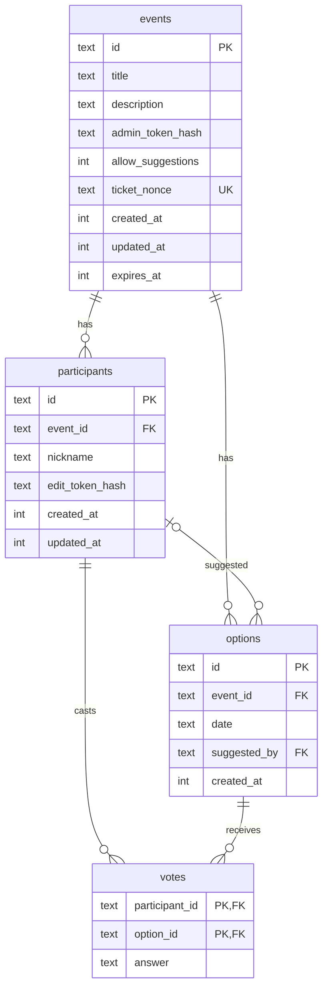

# Database

Pikadai stores its data in Cloudflare D1, which is SQLite. This document describes the schema, the rules
the Worker enforces on top of it, how data expires, and how to work with migrations and the local copy.
Platform behaviour such as limits and backups is in [cloudflare.md](cloudflare.md#d1).

## Overview

Four tables. A poll is an `event`; it has date `options`; `participants` answer with `votes`, one per
option they responded to.



Nothing in the database identifies a person. There are no IP addresses, user agents, emails, or
fingerprints. Nicknames are free text chosen by the participant.

## Conventions

| Convention | Detail |
| --- | --- |
| Identifiers | `TEXT`, 22-character base64url from 16 random bytes. Never sequential, so nothing can be enumerated. |
| Timestamps | `INTEGER` unix epoch milliseconds, UTC. Named `*_at`. |
| Calendar dates | `TEXT` in `YYYY-MM-DD`. No time, no zone. Sorting and comparing as strings is correct. |
| Booleans | `INTEGER` 0 or 1 (SQLite has no boolean type). |
| Secrets | Never stored. Only SHA-256 hex digests of tokens, in `*_token_hash` columns. |

## Tables

### `events`

One row per poll.

| Column | Type | Notes |
| --- | --- | --- |
| `id` | TEXT PK | public poll id; the capability in the share link |
| `title` | TEXT | 1–100 characters, trimmed |
| `description` | TEXT | 0–500 characters, trimmed; default `''` |
| `admin_token_hash` | TEXT | SHA-256 of the 43-character admin token |
| `allow_suggestions` | INTEGER | 1 if participants may add dates; default 1 |
| `ticket_nonce` | TEXT UNIQUE, nullable | nonce from the creation ticket; the UNIQUE index is what makes tickets single-use |
| `created_at` | INTEGER | |
| `updated_at` | INTEGER | bumped by PATCH and by expiry recalculation |
| `expires_at` | INTEGER | when the poll becomes unreadable and eligible for purge; see [Expiry](#expiry) |

Index: `idx_events_expires_at (expires_at)` for the purge query.

### `options`

One row per candidate date in a poll.

| Column | Type | Notes |
| --- | --- | --- |
| `id` | TEXT PK | |
| `event_id` | TEXT FK → events, `ON DELETE CASCADE` | |
| `date` | TEXT | `YYYY-MM-DD`; must be a real calendar date |
| `suggested_by` | TEXT FK → participants, nullable, `ON DELETE SET NULL` | set when a participant proved identity while suggesting; null for creator-added dates. If that participant is later removed the date stays, unattributed. |
| `created_at` | INTEGER | |

Constraints: `UNIQUE (event_id, date)`, so a date appears at most once per poll. Index on `event_id`.

### `participants`

One row per answer in a poll.

| Column | Type | Notes |
| --- | --- | --- |
| `id` | TEXT PK | sent back to the browser together with the edit token |
| `event_id` | TEXT FK → events, `ON DELETE CASCADE` | |
| `nickname` | TEXT | 1–32 characters, trimmed; unique per poll ignoring case, enforced in code with `COLLATE NOCASE` |
| `edit_token_hash` | TEXT | SHA-256 of the participant's edit token |
| `created_at` | INTEGER | |
| `updated_at` | INTEGER | |

Index on `event_id`. Nickname uniqueness is checked by the Worker before insert and update rather than by a
unique index, because SQLite's `UNIQUE` would need a `COLLATE NOCASE` column definition, and the explicit
check lets the API return a specific `nickname_taken` error.

### `votes`

One row per participant per option they answered.

| Column | Type | Notes |
| --- | --- | --- |
| `participant_id` | TEXT FK → participants, `ON DELETE CASCADE` | |
| `option_id` | TEXT FK → options, `ON DELETE CASCADE` | |
| `answer` | TEXT | `CHECK (answer IN ('yes','no','maybe'))` |

Primary key `(participant_id, option_id)`. Index on `option_id`. A missing row means "no answer", which
the UI renders as `·`. Saving an answer deletes all of a participant's votes and inserts the new set in
one batch, so partial updates cannot occur.

## Integrity rules

**Enforced by SQLite**

- Foreign keys with cascades, as listed above. D1 enables foreign-key enforcement by default.
- One date per poll; one vote per participant per option; valid `answer` values; unique ticket nonce.

**Enforced by the Worker** (`worker/routes/*.ts`, `shared/schemas.ts`)

- Field lengths and trimming, real calendar dates, at most 40 options and 100 participants per poll.
- Votes may only reference options belonging to the same event; others are rejected with `unknown_option`.
- Nickname uniqueness per poll, case-insensitive.
- Expired events (`expires_at <= now`) are treated as gone even before the purge deletes them.
- Writes that need to be all-or-nothing use `db.batch()`, which D1 runs as one transaction: event plus
  options on creation; participant plus votes on insert; nickname update plus vote replacement on edit.

## Expiry

`expires_at` is computed in `computeExpiresAt` in `worker/db/queries.ts`:

| Situation | `expires_at` |
| --- | --- |
| Poll has at least one date | midnight UTC after the latest date, plus 30 days |
| Poll has no dates | `created_at` plus 90 days |

It is recomputed whenever an option is added or removed. Example: a poll whose last date is 2026-11-21 expires
at 2026-12-22T00:00:00Z. Adding 2026-11-28 moves that to 2026-12-29; removing it moves it back.

The periods are `ttlAfterLastDateDays` and `ttlWithoutDatesDays` in `shared/limits.ts`. Changing them
affects polls created or edited afterwards; existing rows keep their stored value until an option change
triggers recalculation.

A cron trigger runs daily at 03:17 UTC and executes:

```sql
DELETE FROM events WHERE expires_at <= ?;
```

Cascades remove the poll's options, participants, and votes. The handler logs the number of events removed.

## Access patterns

All SQL lives in `worker/db/queries.ts`. The main ones:

| Function | Used by | Query shape |
| --- | --- | --- |
| `getEventRow` | every `/api/events/:id` route | `SELECT * FROM events WHERE id = ?` |
| `buildEventView` | GET | three selects (options, participants, votes joined to participants) assembled into `EventView` |
| `insertEventWithOptions` | POST events | batch: 1 event insert + N option inserts |
| `insertParticipantWithVotes` | POST participants | batch: 1 insert + N vote inserts |
| `updateParticipantWithVotes` | PUT participant | batch: update, delete votes, insert votes |
| `nicknameTaken` | POST/PUT participant | `… WHERE event_id = ? AND nickname = ? COLLATE NOCASE AND (? IS NULL OR id != ?)` |
| `insertOption` / `deleteOption` / `refreshExpiry` | options routes | insert or delete, then recompute `expires_at` |
| `deleteExpiredEvents` | cron | the purge above |

A poll view costs roughly 3 + participants + options row reads, and creating a poll costs 1 + options row
writes. See the D1 free-plan limits in [cloudflare.md](cloudflare.md#d1) for why this is comfortable.

## Sizing

Rough per-row footprint including indexes: an event about 400 bytes, an option about 120, a participant
about 200, a vote about 90. A typical poll with 6 dates and 10 participants who each answer every date is
around 8 KB. The 5 GB free-plan allowance therefore holds on the order of half a million such polls, and
the nightly purge keeps the live set bounded.

## Migrations

Migrations are plain SQL files in `migrations/`, applied in filename order by `wrangler d1 migrations
apply`. D1 tracks applied files in its own `d1_migrations` table.

**Create one**

```sh
npx wrangler d1 migrations create pikadai add_time_slots
# writes migrations/0002_add_time_slots.sql; edit it
```

**Apply**

```sh
npm run db:migrate:local      # local SQLite under .wrangler/state
npm run db:migrate:remote     # production, after review
```

**Rules of thumb**

- Keep migrations additive where possible: new tables, new nullable columns, new indexes. The previous
  Worker version then still works, which keeps `wrangler rollback` safe.
- SQLite's `ALTER TABLE` supports adding columns and renaming, but not dropping constraints or changing
  types. For those, create a new table, copy data, drop the old one, rename.
- Never edit a migration that has been applied remotely. Add a new one.
- Local and remote migration state are independent. After pulling a branch with new migrations, run the
  local apply again.
- There is no "down" migration. For an emergency revert of production data use D1 Time Travel.

## Working with the local database

The local database is a SQLite file under `.wrangler/state/v3/d1/miniflare-D1DatabaseObject/`, shared by
`npm run dev` and `wrangler d1 … --local`. It is gitignored.

```sh
# Query it
npx wrangler d1 execute pikadai --local --command "SELECT id, title, datetime(expires_at/1000,'unixepoch') FROM events"

# Reset it: stop the dev server first
rm -rf .wrangler/state/v3/d1
npm run db:migrate:local

# Browse bindings and run queries while `npm run dev` is up
curl http://localhost:5173/cdn-cgi/local/explorer/api/d1/database
```

Any SQLite client can open the `.sqlite` file directly for read-only inspection.

## Privacy and retention summary

- Stored: poll text, chosen dates, nicknames, votes, hashed tokens, timestamps.
- Not stored: IP addresses, user agents, emails, device identifiers, Turnstile tokens, creation tickets
  (only their nonce, which is random).
- Retention: until 30 days after the last date, or 90 days without dates, or earlier if the organiser
  deletes the poll. D1 Time Travel keeps 30 days of history after that for disaster recovery.

## Future changes

Time slots would add nullable `start_time` and `end_time` columns to `options` and extend the
`UNIQUE (event_id, date)` constraint to include them, which under SQLite means recreating the table in a
migration. Everything else, including votes and expiry, already works per option and would not change.
